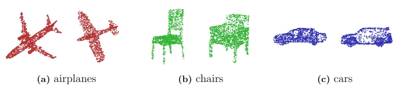

# Point-Transformer-Diffusion

Point Transformer Diffusion (PTD) integrates the standard [DDPM](https://proceedings.neurips.cc/paper/2020/hash/4c5bcfec8584af0d967f1ab10179ca4b-Abstract.html), adapted for 3D data, 
with [Point Transformer](https://openaccess.thecvf.com/content/ICCV2021/html/Zhao_Point_Transformer_ICCV_2021_paper.html?ref=https://githubhelp.com), a local self-attention network specifically designed for 3D point clouds.
- Thesis report: [3D Shape Generation through Point Transformer Diffusion](https://odr.chalmers.se/items/def57c0b-8918-4f80-968c-9b1bfda56433). 
- It achieved outstanding results in the unconditional shape generation task on the ShapeNet dataset.

## Requirements

Make sure the following environments are installed.

```
python
torch
tqdm
matplotlib
trimesh
scipy
open3d
einops
pytorch_warmup
```

You can utilize the yaml file in the *requirements* folder by
```
conda env create -f ptd_env.yml 
conda activate ptd_env
```
, which will take significant time. Then, install *pointops* by

```
cd lib/pointops/
python setup.py install
cp build/lib.linux-x86_64-cpython-39/pointops_cuda.cpython-39-x86_64-linux-gnu.so .
```

Also, install *emd* for evaluation by 

```
cd metrics/PyTorchEMD/
python setup.py install
cp build/lib.linux-x86_64-cpython-39/emd_cuda.cpython-39-x86_64-linux-gnu.so .
```

The code was tested on Ubuntu 22.04 LTS and GeForce RTX 3090.

## Data

For generation, we use ShapeNet point cloud, which can be downloaded [here](https://drive.google.com/drive/folders/1G0rf-6HSHoTll6aH7voh-dXj6hCRhSAQ).

## Pretrained models

Pretrained models can be downloaded [here](https://drive.google.com/drive/folders/1HstSf2kYYGMIc-_w87IMUuIA0dsOcQSe).

## Training

```
$ python train_generation.py --category car|chair|airplane
```
Please refer to the python file for optimal training parameters.

## Testing
```
$ python train_generation.py --category car|chair|airplane --model MODEL_PATH
```

## Results

Evaluation results of the trained models of PTD.

| Category | Model             | CD    | EMD   |
|----------|-------------------|-------|-------|
| airplane | airplane_2799.pth | 74.19 | 61.48    |
| chair    | chair_1499.pth    | 56.11 | 53.39 |
| car      | car_2799.pth      | 56.39 | 52.69 |

Visualization of several generated results: 

<p align="center">
  
</p>

## Acknowledgements

DDPM for 3D point clouds: [Point-Voxel Diffusion](https://github.com/alexzhou907/PVD). <br>
Point Transformer: 
- [The version of my implementation](https://github.com/jxl152/Point-Transformer),
- [Pointcept](https://github.com/Pointcept/Pointcept).
- [The CUDA library of pointops](https://github.com/hszhao/PointWeb).